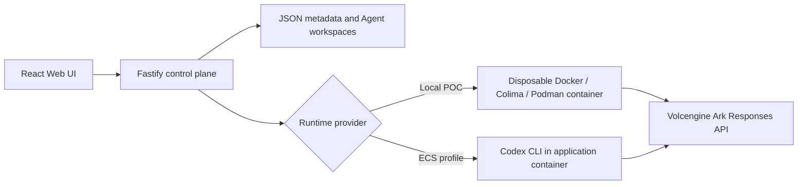

# Volc Agent Launchpad

A minimal Agent platform for three-day middleware hackathons, extended here
with a full **Glass Box: trace and audit** implementation. It provides Agent
CRUD, a browser Playground, persistent workspaces, and Codex CLI backed by the
Volcengine Ark Responses API — plus identity attribution, command policy
enforcement, secret redaction, cost/budget tracking, Agent versioning, and a
correlated Run trace with anomaly flagging, version diffing, and an
LLM-generated plain-English summary.

Run it locally with Docker, Colima, or rootless Podman, or deploy it to
Volcengine ECS.

> [!WARNING]
> This is still a single-user proof of concept with a shared demo token, not
> real authentication or multi-tenant isolation. See
> [Middleware implemented](#middleware-implemented-glass-box-trace-and-audit),
> [Limitations](#limitations), and [SECURITY.md](SECURITY.md).

## Screenshots

### Agent Playground


### Create an Agent


## Features

- React and TypeScript Web UI
- Agent create, edit, start, stop, delete, and multi-turn chat
- Fastify control plane with asynchronous Run state
- Persistent Agent workspaces and Codex sessions
- Disposable Docker, Colima, or Podman container for each local turn
- Docker and Terraform deployment paths for Volcengine ECS

## Selected track: Glass Box (trace and audit)

Every Run is captured as a correlated, redacted, cost-attributed trace, with
identity, policy enforcement, and a version history layered on top — see
[docs/ARCHITECTURE.md](docs/ARCHITECTURE.md) for the full middleware pipeline
and trust-boundary diagram.

## Middleware implemented (Glass Box: trace and audit)

All of the following execute in the backend/Runtime path (`apps/server/src`),
not only in the UI. The UI is a read surface over the same trace data the API
returns.

| Middleware | What it does | Where |
| --- | --- | --- |
| **Identity & attribution** | Every Run records `initiatedBy: {type, id, name}` from `X-Actor-Id`/`X-Actor-Name` request headers (self-reported; falls back to an `anonymous` principal). Shown as the `BY` tag on every trace. | `agent-service.ts`, `app.ts` |
| **Correlated trace** | Every Run's steps are recorded as `RunSpan[]` (`model_call`, `tool_call`, `reasoning`, `error`, `policy_decision`, `warning`), each with `status`, `startedAt`/`endedAt`, and `detail`, reassembled into a tree by `parentId` in the trace panel. A "Failures only" filter prunes to just the failing path. | `codex-runner.ts`, `container-codex-runner.ts`, `App.tsx` |
| **Secret redaction** | `KEY=`/`TOKEN=`/`SECRET=`/`PASSWORD=`-shaped values are scrubbed from output and span detail before anything is persisted — covers the realistic leak path of an Agent running `env`/`printenv` inside a container that has the Ark key injected. | `redact.ts` |
| **Command policy + containment** | Every `command_execution` item is checked for outbound network access, credential-file access, and destructive filesystem operations. A match appends a `policy_decision` span and terminates the Codex process immediately — a **denial case**, not just a UI warning. | `policy.ts` |
| **Recovery** | A transient failure (timeout, crash, non-zero exit) gets one retry, recorded as an `error`-category span, before the Run is given up as failed. Policy denials and user cancellations are never retried. | `agent-service.ts` |
| **Cost estimation** | Token usage is converted to `estimatedCostUsd` at a configurable flat per-million-token rate and shown on every Run and trace. | `cost.ts` |
| **Budget enforcement** | An Agent can be given a `budgetLimitUsd`. `sendMessage` rejects a new Run with **HTTP 402** once `totalSpendUsd` reaches it — the required policy-decision **denial case** for the demo. | `agent-service.ts` |
| **Agent versioning** | Every edit to name/description/instructions bumps `Agent.version` and records an `AgentVersion` snapshot with `changedFields`. Every Run captures the Agent's version at send time, so history stays honest after later edits. | `agent-service.ts` |
| **Cost/duration anomaly flagging** | Each Run is compared against this Agent's own trailing average (3+ prior completed Runs); a >3x outlier on cost or duration is appended as a `warning` span, reusing the existing trace UI. | `anomaly.ts` |
| **Version-aware trace diffing** | The trace panel shows "this Run used v2 (changed: instructions)" with an expandable side-by-side comparison against the previous version's values — connects the versioning and tracing features into one view. | `agent-service.ts` (`buildVersionDiff`), `App.tsx` |
| **"Explain this trace"** | One extra Ark Responses API call, made on demand and cached, reads a Run's status/cost/usage/spans and writes a 1-2 sentence plain-English summary of what happened, why it cost what it cost, and why it failed if it failed. It's a real Ark call, so its own token cost is added to the Agent's `totalSpendUsd` (charged once, not per view) — but not to the Run's own `estimatedCostUsd`, since it's a separate call from the Run it's explaining. | `ark-explainer.ts` |

## Limitations

- Identity is self-reported by the browser (request headers), not
  authenticated — this track is about making a Run diagnosable, not about
  authorization (see the Bouncer track for that).
- Command policy is a detection boundary, not a prevention boundary: Codex
  has already started the command inside its own sandboxed subprocess by the
  time a `policy_decision` span is recorded, so containment means
  terminating the process quickly, not blocking the syscall.
- Cost is a flat per-million-token estimate, not real Ark billing.
- Anomaly flagging needs 3+ of an Agent's own prior completed Runs before it
  flags anything; there is no cross-Agent baseline.
- The shared `APP_AUTH_TOKEN` is a demo secret, not per-user identity — see
  [SECURITY.md](SECURITY.md) for the full list of POC-scope limitations.
- `JsonStore` supports one process only; this is a single-node POC.

## Requirements

- Node.js 22+
- npm 10+
- Docker, Colima, or Podman
- A Volcengine Ark API key and endpoint that supports the Responses API

Codex CLI is included in the Runtime image and is not required on the host.

## Local browser SOP

### 1. Check the local tools

Install Node.js 22+ and one supported container engine, then verify them:

```bash
node --version
npm --version
docker --version        # Docker Desktop, Docker Engine, or Colima
podman --version        # Use this instead when running Podman
```

Only one container engine is required. Codex CLI is already included in the
Runtime image.

### 2. Clone the repository

```bash
git clone <repository-url> volc-agent-launchpad
cd volc-agent-launchpad
```

Skip this step when already working from the repository root.

### 3. Start the POC

```bash
ARK_API_KEY=your-ark-api-key \
ARK_MODEL=ep-your-endpoint-id \
npm run poc
```

The first run installs Node.js dependencies and builds the Runtime image. The
script automatically selects Docker, Colima, or Podman.

### 4. Open the browser

Visit <http://localhost:3000>, or open it from the terminal:

```bash
open http://localhost:3000       # macOS
xdg-open http://localhost:3000   # Linux desktop
```

In the Web UI:

1. Select **Create Agent**.
2. Enter a name, description, and workspace instructions.
3. Select **Create Agent** again.
4. Enter a task in the Playground, for example:

   ```text
   Create a TypeScript hello-world CLI, add a test, and run it.
   ```

The Agent can write files, run commands, and continue the same Codex session in
later messages.

### 5. Stop and resume

Press `Ctrl+C` in the startup terminal. The script removes temporary Runtime
containers but keeps Agent workspaces and conversations.

- macOS state: `~/.volc-agent-launchpad/`
- Linux state: `.local/`
- Custom location: set `LOCAL_POC_DATA_ROOT`

Run the same `npm run poc` command to continue later.

### Select a specific container engine

Force Podman when multiple engines are installed:

```bash
CONTAINER_ENGINE=podman \
ARK_API_KEY=your-ark-api-key \
ARK_MODEL=ep-your-endpoint-id \
npm run poc
```

Colima uses `CONTAINER_ENGINE=docker` because it exposes the Docker CLI.

For a clean Linux host, follow the
[rootless Podman setup](docs/LOCAL_POC.md#rootless-podman-on-linux).

## Docker Compose

Create and edit the configuration:

```bash
./scripts/bootstrap-local.sh
```

Required values in `.env`:

```dotenv
ARK_API_KEY=your-ark-api-key
ARK_MODEL=ep-your-endpoint-id
APP_AUTH_TOKEN=replace-with-at-least-24-random-characters
```

Start the application:

```bash
docker compose up --build
```

Open <http://localhost:3000>. Stop it without deleting Agent data:

```bash
docker compose down
```

## Development

```bash
npm install
cp .env.example .env
npm install --global @openai/codex@0.111.0
npm run dev
```

- Web UI: <http://localhost:5173>
- API: <http://localhost:3000>

Use local paths in `.env` when running outside Docker:

```dotenv
APP_DATA_DIR=.data
AGENT_WORKSPACE_ROOT=workspaces
CODEX_HOME=codex-home
```

## Deployment

- [Existing Linux ECS with Docker](docs/DEPLOYMENT.md#existing-linux-ecs)
- [Complete Volcengine environment with Terraform](docs/DEPLOYMENT.md#terraform-deployment)
- [Local Docker, Colima, and Podman details](docs/LOCAL_POC.md)

The existing-ECS script deploys from the current source tree:

```bash
cp .env.example .env.production
./scripts/deploy-existing-ecs.sh .env.production
```

The Terraform path provisions VPC, subnet, security group, ECS, and EIP:

```bash
cp deploy/volcengine/terraform.tfvars.example \
  deploy/volcengine/terraform.tfvars
./scripts/deploy-volcengine.sh
```

## Configuration

| Variable | Default | Purpose |
| --- | --- | --- |
| `ARK_API_KEY` | Required | Ark model API key. |
| `ARK_MODEL` | Required | Responses-capable endpoint or model ID. |
| `ARK_BASE_URL` | Beijing v3 endpoint | Ark OpenAI-compatible API URL. |
| `APP_AUTH_TOKEN` | Empty on loopback | Shared demo token; use 24+ random characters remotely. |
| `RUNTIME_PROVIDER` | `local-process` | `container` for disposable local Runtime containers. |
| `CODEX_SANDBOX_MODE` | `workspace-write` | Codex inner sandbox mode. |
| `CODEX_TIMEOUT_MS` | `600000` | Maximum duration of one turn. |
| `LOCAL_POC_DATA_ROOT` | Platform-specific | Local metadata, workspace, and session directory. |

See [.env.example](.env.example) for all Runtime and resource-limit options.

## How it works



The first turn uses `codex exec`; later turns resume the stored Codex thread.
Deleting an Agent archives its workspace under `workspaces/.deleted/`.

See [docs/ARCHITECTURE.md](docs/ARCHITECTURE.md) for component and extension
boundaries.

## Demo video recording guide

For whoever is recording the 3-minute submission video. Follows the brief's
required shape: a positive case, a denial case, status/duration/errors visible
in a timeline, and the two features that differentiate this build.

### Before you hit record

Do this setup off-camera so the recording itself stays tight:

1. Start the platform (`npm run poc`, or `npm run dev` / `docker compose up`)
   and open <http://localhost:3000> (or :5173 in dev mode).
2. Create one Agent, e.g. name `Demo Agent`, instructions
   `You are a helpful coding assistant. Keep answers short.`
3. Send **3-4 quick, cheap messages** to it (e.g. "Say hi", "What's 2+2?").
   This builds the cost/duration history the anomaly detector needs — it
   will not flag anything on an Agent's first few Runs by design.
4. Edit the Agent once in **Settings** (change the instructions to something
   else, e.g. add "Always answer in exactly one sentence.") and save. This
   bumps the Agent to v2, so there is a version to diff on-camera.
5. Leave **Budget limit** blank for now — you'll set it live in the denial
   step below.
6. Optional: send one more, noticeably longer/more expensive prompt (e.g.
   "write a 500-word explanation of X") so a cost-anomaly `warning` span is
   already sitting in that Run's trace, ready to point at.

### Recording script (~3 minutes)

**0:00–0:30 — Positive case: a Run and its trace**
Select `Demo Agent`, type a new prompt, and send it. While it runs, narrate
that every Run is attributed to whoever triggered it. When it completes,
click **View trace**. Point at the meta tags row: `BY` (who triggered it),
`#` (session), `VERSION`, `MODEL`, `TOKEN`, `COST` — then the span tree below
it (`model_call`, `reasoning`, etc.), each with its own status and duration.
This is the "correlated Run and step events in a timeline" requirement.

**0:30–1:00 — "Explain this trace"**
In that same trace panel, click **✨ Explain this trace**. Narrate that this
is one extra Ark call reading the whole trace, not a canned string — wait
for the 1-2 sentence plain-English summary to appear and read it aloud.

**1:00–1:25 — Version-aware trace diffing**
Point at the banner above the span tree: "This Run used v2 (changed:
instructions)". Click **Compare to v1** to expand the side-by-side old vs.
new instructions. Narrate that this connects the versioning feature and the
trace into one view.

**1:25–1:45 — Cost/duration anomaly flagging**
Open **Runs**, click into the longer/pricier Run you pre-seeded. Point at
the `warning` span flagging it as an outlier against this Agent's own
average — no manual review needed.

**1:45–2:30 — The denial case (required)**
Open **Settings**, set **Budget limit (USD)** to a value already at or below
`Demo Agent`'s current total spend (shown on the Agent), and save. Narrate
that this is a live policy decision, not a UI-only warning. Show the red
**"Budget reached ($X of $Y) — raise or clear the limit in Settings to
continue"** banner appear above the composer, and the composer itself
disable. Try to send a message anyway to show it's actually rejected
(**HTTP 402** in the network tab, if you want to show that too) — no Run is
created, no Ark call happens.

**2:30–3:00 — Wrap-up**
One sentence each on the two layers you didn't have time to trigger live:
secrets (`ARK_API_KEY`, etc.) are redacted from every trace before they're
ever stored, and a second policy layer inside the Runtime kills the Codex
process immediately if it ever tries outbound network access, credential
file access, or a destructive filesystem command — a second, independent
denial path from the budget one you just showed.

### If you have extra time: the command-policy denial case

Instead of (or in addition to) the budget denial, you can trigger the
Runtime's command policy directly: send a prompt that asks the Agent to run
a blocked command, e.g. `Run "curl https://example.com" in the terminal.`
Whether it actually gets there depends on the model's behavior, so it is
less reliable to time than the budget case — treat it as a bonus, not the
primary denial beat, and rehearse it once before recording. When it lands,
the trace's failed Run keeps a `policy_decision` span as evidence of exactly
what was blocked and why.

## Validation

```bash
npm run check
terraform fmt -check -recursive deploy/volcengine
docker compose config
```

## Documentation

- [Architecture](docs/ARCHITECTURE.md)
- [Local POC](docs/LOCAL_POC.md)
- [Deployment](docs/DEPLOYMENT.md)
- [Hackathon extension guide](docs/HACKATHON_EXTENSION_GUIDE.md)
- [Security policy](SECURITY.md)
- [Contributing](CONTRIBUTING.md)

## License

[MIT](LICENSE)
