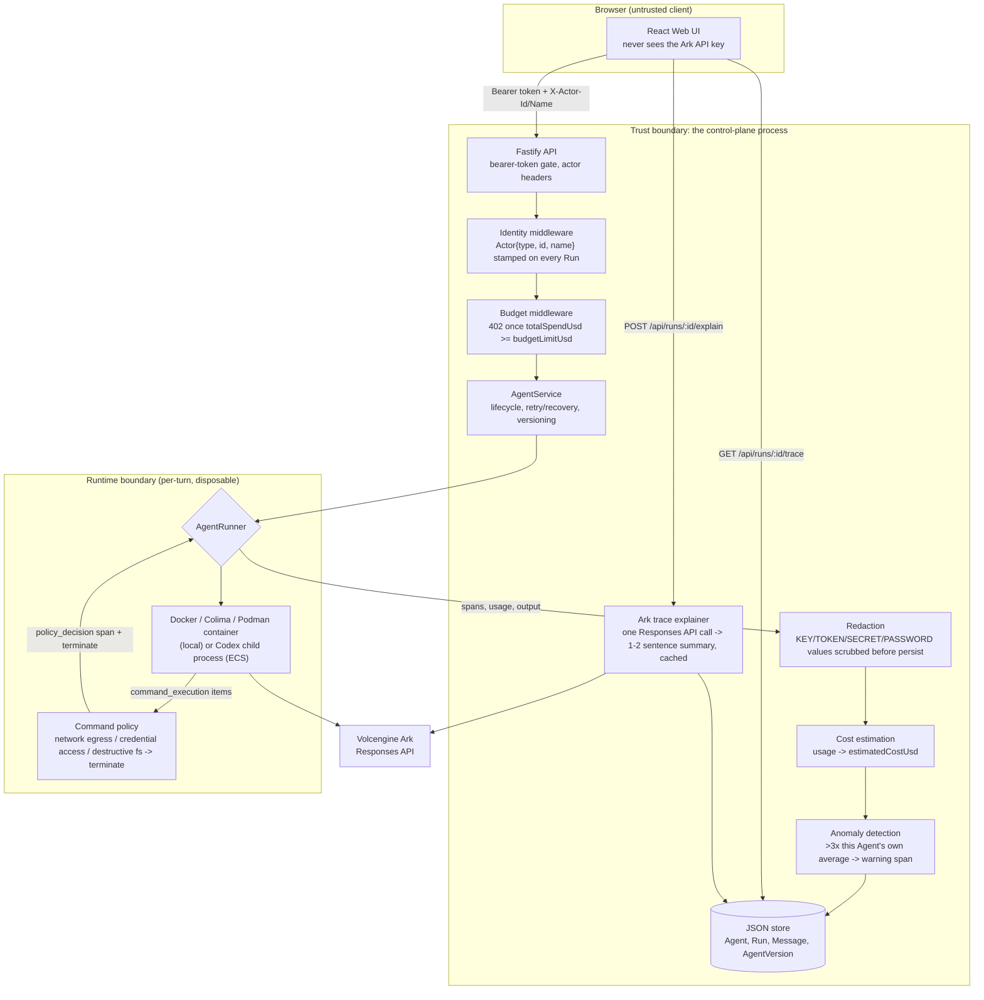

# Architecture

Volc Agent Launchpad is a single-node control plane for hackathon use. This
fork implements the **Glass Box (trace and audit)** track: every Run is
captured as a correlated, redacted, cost-attributed trace, with identity,
policy enforcement, and a version history layered on top.

## Middleware and trust boundary



The **trust boundary** is the control-plane process: the Ark API key, the raw
(pre-redaction) command output, and the policy decision all live there and
never cross into the browser. The **Runtime boundary** is one disposable
container or child process per turn — Codex has already decided to run a
command by the time the policy layer observes it (a detection boundary, not
a sandboxed prevention boundary), so containment means terminating that
process, not blocking the syscall.

## Middleware pipeline (request to trace)

1. **Identity** — `X-Actor-Id` / `X-Actor-Name` request headers (self-reported
   by the browser; there is no real auth) are stamped onto the Run as
   `initiatedBy: Actor`. A request with no headers is attributed to a mock
   `anonymous` principal rather than left unattributed.
2. **Policy gate (budget)** — `AgentService.sendMessage` rejects a new Run
   with `402` once `Agent.totalSpendUsd >= Agent.budgetLimitUsd`, inside the
   same atomic store transaction that reads both fields.
3. **Execution** — `AgentRunner` (local disposable container or ECS child
   process) runs the turn and reports back `spans[]`, token `usage`, and the
   raw output.
4. **Command policy** — every `command_execution` item Codex reports is
   checked against `evaluateCommandPolicy` (network egress, credential-file
   access, destructive filesystem ops). A match appends a `policy_decision`
   span and terminates the Codex process; the Run fails with those spans
   preserved as evidence.
5. **Recovery** — a non-policy, non-cancellation failure (timeout, crash,
   non-zero exit) gets one retry, recorded as an `error`-category span, before
   the Run is given up as failed.
6. **Redaction** — before the output or any span detail is persisted,
   `redact()` scrubs `KEY=`/`TOKEN=`/`SECRET=`/`PASSWORD=`-shaped assignments
   (the Ark key is injected into the Runtime as an env var, so `env` or
   `printenv` output is the realistic leak path).
7. **Cost + anomaly** — token usage is converted to `estimatedCostUsd`
   (flat per-million-token rate); the Run is compared against this Agent's
   own trailing average (3+ prior completed Runs) and flagged with a
   `warning` span if it is a >3x outlier on cost or duration.
8. **Version diffing** — the Run's captured `agentVersion` is joined against
   `AgentVersion` history to show what changed since the previous version.
9. **Explain (on demand)** — `POST /api/runs/:id/explain` sends the Run's
   status/cost/usage/spans to Ark's Responses API once and caches the
   returned 1-2 sentence summary on the Run. This is itself a real Ark call,
   so its token cost is added to `Agent.totalSpendUsd` (once, not per view)
   — but not to the Run's own `estimatedCostUsd`, and it is not itself
   gated by the budget check in step 2.

## Components

### Web UI

Lists Agents, manages lifecycle actions, submits prompts, and renders the
trace panel (span tree, meta tags, version diff, cost/duration warnings, the
"Explain this trace" summary). It never receives the Ark API key.

### Fastify API

Validates requests, protects remote demos with a shared bearer token, reads
`X-Actor-Id`/`X-Actor-Name` for attribution, and serves the compiled Web UI.
The bearer token is a shared demo secret, not user identity or authorization.

### AgentService

Coordinates lifecycle state, persistence, workspaces, Runs, versioning, cost
tracking, and the retry/recovery loop. One Agent can have only one active Run.

```text
ready -> busy -> ready
  |       |
  v       v
stopped  error
```

Interrupted Runs become `cancelled` after a restart.

### Storage

```text
data/launchpad.json       Agent, message, Run, and AgentVersion metadata
workspaces/AgentID/       Agent-created files
workspaces/.deleted/      Archived deleted workspaces
codex-home/               Codex configuration and sessions
```

`JsonStore` serializes writes and atomically replaces one JSON file, with a
sequential migration chain (`DATABASE_VERSION` 1 -> 8) so every field added
by this track's middleware backfills honestly on old data (usually `null`,
never fabricated).

### Runtime providers

- `CodexRunner` runs Codex inside the application container for ECS.
- `ContainerCodexRunner` starts one disposable Docker, Colima, or Podman
  container for every local turn.

Both providers use argv-only process execution, bound output and time,
evaluate the command policy against every `command_execution` item, resume
the stored Codex thread, and escalate termination after a grace period.

## Deployment profiles

| Profile | Control plane | Agent execution |
| --- | --- | --- |
| Local POC | Host Node.js | Disposable local container |
| ECS | Application container | Codex process in the same container |
| Local development | Host Node.js | Host Codex process |

## Limitations

- Identity is self-reported (browser-sent headers), not authenticated — this
  track is about making a Run diagnosable, not about authorization (that is
  the Bouncer track).
- Command policy is a detection boundary: Codex has already started the
  command by the time a `policy_decision` span is recorded, so containment
  is "terminate fast," not "prevent."
- Cost is a flat per-million-token estimate, not real Ark billing.
- Anomaly flagging needs 3+ of an Agent's own prior completed Runs before it
  will flag anything — there is no cross-Agent baseline.
- `JsonStore` supports one process only; this is a single-node POC.
- Redaction is regex-based on `KEY=`/`TOKEN=`/`SECRET=`/`PASSWORD=` shaped
  text, not a general secret scanner.
